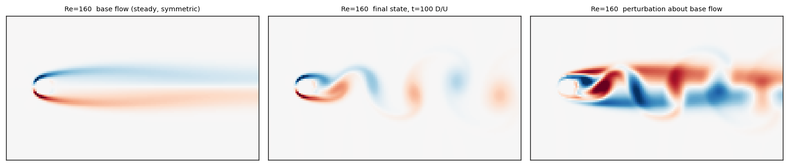
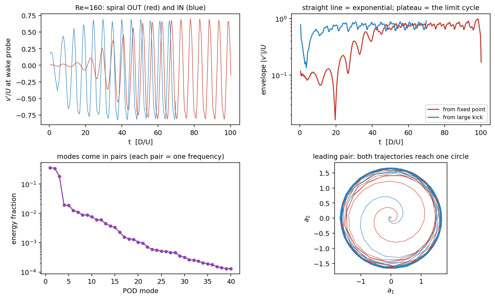

# A parametric neural ODE for the cylinder-wake Hopf bifurcation

**Project brief — one month, undergraduate**

---

## 1. The problem

A neural ODE learns a vector field `ż = f_θ(z)` from trajectory data. Trained on
one system it can be very good at reproducing that system. But a learned vector
field is only ever as informative as the region of state space the training data
visited, and this creates a specific, well-known failure: a model fitted to a
system's *attractor* has essentially no information about the rest of the phase
portrait, and will happily produce a confident, wrong answer about what the
system does under conditions it never saw.

The sharpest version of this question is a **bifurcation**. Consider a family of
systems indexed by a parameter μ:

```
ż = f_θ(z, μ)
```

and suppose that as μ increases past a critical value μ_c the qualitative
behaviour changes — a stable equilibrium loses stability and the system begins to
oscillate. Every trajectory in the training set is just a time series. Nothing in
the data is labelled "bifurcation". The question is whether a model fitted to
trajectories at a scattering of μ values *internalises the transition*: whether,
when you interrogate the learned `f_θ` at parameter values it never trained on,
you recover the correct critical value, the correct growth rates, the correct
oscillation amplitude — and the *unstable* branch, which was never an attractor
and therefore never appeared in any training trajectory at all.

That is the project. It is a good one-month problem for three reasons.

**It is falsifiable.** For the system chosen here the answers are known
independently and in closed form. The student is not reduced to reporting
held-out trajectory error; they can compare a learned vector field against
published growth rates and amplitude laws. Very few machine-learning-for-dynamics
projects offer that.

**It has a clean negative result available.** If the parametric model fails to
extrapolate, that failure is itself measurable and interesting, and can be
attributed to a specific cause — insufficient parameter coverage, missing
transient data, or an architecture with the wrong inductive bias.

**The compute is trivial once the data exists.** With a 3–16 dimensional latent
state, the entire training set is well under a megabyte and a full architecture
sweep runs in minutes on a laptop. The expensive part — generating the data —
is already done.

### What success looks like

A single model `f_θ(z, μ)`, trained on trajectories at scattered μ, that when
probed on a fine μ grid it never saw:

1. has a fixed point whose Jacobian eigenvalues cross the imaginary axis at the
   correct μ_c;
2. reproduces the correct oscillation frequency at onset;
3. reproduces the correct saturated amplitude scaling;
4. can be continued to recover the **unstable** equilibrium branch above onset,
   which appears in no training trajectory.

Item 4 is the one worth aiming for. It is the difference between a model that
memorised some trajectories and a model that learned a family of vector fields.

---

## 2. The system

### 2.1 Why the cylinder wake

Two-dimensional incompressible flow past a circular cylinder, with a single
parameter, the Reynolds number `Re = U D / ν`.

Below a critical Reynolds number the wake is a **steady, symmetric recirculation
bubble** — a stable fixed point of the Navier–Stokes equations. Above it, a pair
of complex-conjugate global eigenvalues crosses the imaginary axis and the flow
settles onto a **limit cycle**, the von Kármán vortex street. The transition is a
supercritical Hopf bifurcation.

Crucially for this project, **the two-dimensional flow stays cleanly periodic**
across the whole range swept here. There is a bifurcation, and a limit cycle, and
no route to chaos to muddy the picture. Real three-dimensional wakes develop
spanwise instabilities at higher Reynolds number, but a two-dimensional
simulation does not, and for a study of learned bifurcation structure that is a
feature rather than a limitation.

The cylinder wake is also the most heavily studied configuration in data-driven
fluid dynamics, which means the reduced-order modelling literature against which
a learned model can be compared is unusually deep.

### 2.2 Why the data had to be generated

Public cylinder datasets are abundant — the Brunton–Kutz `CYLINDER_ALL.mat`,
DeepMind's MeshGraphNets `cylinder_flow`, CFDBench, and others. **None of them
fits this problem**, and the reason is instructive rather than incidental.

Every one of those datasets was built to *forecast or reconstruct the attractor*.
This project needs to *locate a bifurcation*. Three consequences follow:

- **None ships the unstable steady base flow above onset.** It is useless for
  forecasting and requires a separate computation, so nobody computes it.
- **None has transients launched near the fixed point.** They start impulsively
  from rest, along trajectories that pass nowhere near the unstable equilibrium
  and therefore do not constrain the linearisation the Hopf bifurcation is about.
- **Almost none goes below onset at all.**

Add the requirements of a common spatial grid across parameter values and a
single cleanly varied parameter, and the intersection is empty.

### 2.3 The solver

A D2Q9 lattice-Boltzmann solver, roughly 200 lines, running on the GPU. Lattice
Boltzmann was chosen because it needs no pressure Poisson solve, so the entire
time-stepper is a handful of array operations that a student can read in an
afternoon.

Two implementation choices matter enough to state:

**Two-relaxation-time (TRT) collision rather than BGK.** Under plain BGK the
effective position of a bounce-back wall drifts with the relaxation time, and the
relaxation time is set by viscosity. The effective cylinder diameter — and hence
the effective Reynolds number — would therefore change as the sweep progressed.
For a study whose entire purpose is locating a critical Reynolds number, that is
disqualifying. TRT removes it: viscosity-independence of the effective wall
position is a generic property of the two-relaxation-time operator at any fixed
magic parameter Λ = (τ⁺ − ½)(τ⁻ − ½), and that independence is precisely what a
Reynolds sweep needs. The particular value Λ = 3/16 additionally places the wall
midway between the last fluid and first solid node — exactly so for
lattice-aligned straight walls with low-degree polynomial solutions, and only
approximately for a curved boundary such as a cylinder, where no Λ makes simple
bounce-back exact. TRT is also more stable at the low relaxation times the
high-Reynolds end of the sweep requires.

Under BGK the two relaxation rates coincide, Λ = (τ − ½)², and the halfway wall
is recovered only at the single value τ = ½ + √3/4 ≈ 0.9330.

**Free-slip lateral walls.** A free-slip wall *is* a symmetry plane, which lets
one solver serve two purposes — see below.

### 2.4 The base flow: the ingredient that makes this work

The single most important design decision in the dataset.

Above onset, the steady symmetric wake still exists as a solution of the
Navier–Stokes equations — it is simply **unstable**, so it cannot be reached by
time-marching. It is also exactly what a bifurcation-locating model needs: the
fixed point whose stability is changing.

It is obtained here by simulating only the **upper half plane**, with the
cylinder centre placed on the free-slip boundary. The von Kármán mode is
antisymmetric in the transverse velocity, so it cannot exist in that subspace;
the run relaxes to the steady solution at any Reynolds number, however far above
onset. The result is mirrored back to the full domain, with `u_x` even and `u_y`
odd about the centreline. The parity of the reconstruction was verified to be
exact.



The left panel is that unstable steady wake. The middle is the saturated vortex
street. The right is the difference, and **the difference field is what the
dataset stores**.

### 2.5 Perturbation coordinates

Every snapshot is stored as the perturbation about *that Reynolds number's own*
base flow. This places the fixed point at the origin of state space for **every**
parameter value, so a parametric model only has to learn how the linearisation at
the origin moves with Re.

Store raw fields instead and the model must simultaneously learn a large,
Re-dependent mean shift and a comparatively tiny change of stability. The
bifurcation gets buried under the mean flow.

A useful consequence: `f(0, μ) = 0` is exactly true for all μ, and can be
enforced architecturally rather than learned. See §3.2.

### 2.6 Trajectory design

Each Reynolds number gets **two** trajectories:

- an **outward** run, started at the base flow plus a small kick, which records
  the entire spiral out onto the limit cycle (or the decay back to the fixed
  point, below onset);
- an **inward** run, started *outside* the limit cycle, which decays onto it.

The second exists because a model fed only outward trajectories sees the vector
field inside the cycle and never outside, and so has nothing pinning down the
cycle's stability from the far side.

Getting the inward run right required care. A large localised velocity blob does
*not* start you outside the limit cycle however large you make it: it is
spatially localised, so it projects weakly onto the global wake modes, advects
away within a few convective times, and the run then grows out from near the
fixed point like any other. The working approach is to run to saturation and then
**scale the converged periodic state outward**, which keeps the field
divergence-free and is therefore a legitimate initial condition. The scale factor
is clamped so the peak speed stays within 15% of a value the solver has already
demonstrated it is stable at. In practice the inward runs start at 1.26–1.42×
the limit-cycle amplitude and decay onto it.

### 2.7 What the dataset contains

| quantity | value |
|---|---|
| parameter points (Re) | 17, from 30 to 160, clustered near onset |
| trajectories | 34 (outward + inward per Re) |
| field state dimension | 80 × 140 × 2 = **22,400** |
| sampling interval | 0.4 D/U, uniform throughout |
| samples per shedding period | 13–33 |
| snapshots, total | ≈ 11,700 |
| size on disk | ≈ 600 MB compressed |

Run lengths are **not** uniform, and this is deliberate. The budget for each case
is `5/σ(Re) + 90` convective times — five e-foldings to cross from the kick to
saturation, plus roughly fifteen shedding periods of settled behaviour. Because
the growth rate σ vanishes at the bifurcation (critical slowing down), that
formula stretches near onset and contracts far from it: 1125 snapshots at Re = 48
against 250 at Re = 160.

The runs are therefore *equal length in the natural dynamical time* 1/σ and
unequal in convective time. A fixed snapshot count would either over-resolve the
high-Reynolds end fourfold or truncate exactly the near-onset transients that
carry the bifurcation. The sampling interval is uniform everywhere, so the data
is ragged in length only — a rectangular `(p, m, r)` tensor is available by
cropping to a common window, at no loss of sampling rate.

### 2.8 Measured behaviour

The limit-cycle amplitude decreases monotonically toward onset, and the inward
and outward runs agree to better than 0.5% at every Reynolds number — an
independent check that both reach the same attractor:

| Re | 80 | 90 | 102 | 118 | 138 | 160 |
|---|---|---|---|---|---|---|
| A/U | 0.426 | 0.476 | 0.525 | 0.591 | 0.685 | 0.758 |
| A² | 0.181 | 0.226 | 0.276 | 0.349 | 0.469 | 0.574 |

The measured linear growth rate crosses zero at

> **Re_c = 44.2 ± 0.3,   dσ/dRe = 0.0050 ± 0.0004 (U/D per unit Re)**

with useful local form σ(Re) ≈ 0.0050 (Re − 44.2) − 1.5×10⁻⁴ (Re − 44.2)².

| Re | 36 | 41 | 45 | 48 | 51 | 54 |
|---|---|---|---|---|---|---|
| σ (U/D) | −0.046 | −0.016 | **+0.0040** | +0.0170 | +0.0286 | +0.0393 |

**Do not use the amplitudes to find Re_c.** Extrapolating A²_sat to zero is the
textbook route and it does not converge on this data:

| points used | ≤ 48 | ≤ 54 | ≤ 62 | ≤ 73 | ≤ 80 |
|---|---|---|---|---|---|
| implied Re_c | 44.6 | 44.0 | 42.4 | 39.2 | 36.8 |

It runs away monotonically as far-from-threshold points are added, because
dA²/dRe falls by a factor 6.7 across the sweep. Any value it returns is a
coordinate of where the fit was truncated, not an estimate. Two such fits
agreeing with each other is *not* evidence of convergence if both are dominated
by far-from-threshold points. Weakly nonlinear theory only licenses the
Stuart–Landau linearity within roughly 10% of onset; the apparent linearity out
to Re = 160 is an empirical observation and must not be extrapolated backwards.

Record A_sat and the implied Landau coefficient l = σ/A²_sat as *diagnostics*.
On this data l is smooth from Re = 48 upward (1.55, 1.10, 0.90, 0.76, 0.68) but
jumps to 5.0 at Re = 45 — the limit cycle nearest onset is markedly smaller than
a smooth Hopf predicts, and the probe/field amplitude ratio shifts 27% between
Re = 45 and 48, so the saturated mode shape is changing quickly there. The
amplitude is not a clean normal-form coordinate at any Re in this dataset.

Re_c = 44.2 sits below the unconfined literature value of 46.6–47.0. This is a
confinement effect and it is self-consistent: free-slip walls 6 D out accelerate
the flow past the cylinder, so instability is reached at a lower *nominal*
Reynolds number based on the free-stream speed, and for the same reason the
measured Strouhal numbers run above the unconfined correlation. Both deviations
have the same sign and the same cause.

Two limits of the growth-rate data itself. Above Re ≈ 90 the linear phase lasts
under three shedding periods, so σ is not resolvable there and `growth.py`
refuses to report a precise value rather than producing a window-dependent one.
And Re = 30 is unusable — two beating damped modes, with the signal reaching the
float32 floor partway through the record. Neither affects Re_c.

---

## 3. The proposed modelling technique

### 3.1 Reduction

Project all trajectories onto a **single POD basis shared across the whole
sweep**, computed from the pooled snapshot matrix with each case normalised to
equal weight.

Both halves of that sentence matter.

*Shared*: compute POD per Reynolds number and `a₃` at Re = 60 is a different
physical direction from `a₃` at Re = 150, so `f(z, μ)` would be interpolating
between coordinate systems rather than between vector fields.

*Equally weighted*: fluctuation energy grows steeply with Re, so an unweighted
pooled SVD lets the top of the sweep own the basis and resolves the near-onset
cases — the ones carrying the bifurcation — with whatever is left.

The mean is **not** subtracted before the SVD. The snapshots are already
perturbations about each base flow, so the origin is already the fixed point;
subtracting a sweep mean would move it.

### 3.2 What the latent coordinates are

The POD coefficients organise themselves exactly as the mean-field theory of the
cylinder wake predicts. At Re = 160:

| modes | energy | frequency | interpretation |
|---|---|---|---|
| a₁, a₂ | 35.5 + 33.9% | f₁ | the oscillating pair — vortex shedding |
| a₃ | 18.0% | ≈ 0 | **unpaired shift mode** — mean-flow deformation |
| a₄–a₇ | 1–2% each | f₁ | higher corrections at the fundamental |
| a₈–a₁₀ | ≈ 0.9% | 1.90 f₁ | second harmonic |
| a₁₁, a₁₂ | ≈ 0.6% | 2.90 f₁ | third harmonic |



The unpaired third mode is the important one. It is *not* an oscillation; it is
the deformation of the mean flow away from the base flow, and it is what
saturates the instability. It is the reason a two-mode POD model can reproduce
the limit cycle but not the transient onto it.

The reason is worth stating correctly, because the usual dimension-counting
explanation is wrong: a two-dimensional system can perfectly well have an
unstable fixed point and a stable limit cycle, and the one-dimensional Landau
equation captures the transient. The failure is about the *basis*. A POD basis
computed from limit-cycle snapshots alone does not span the direction
`u₀ − u_s` separating the mean flow from the unstable steady solution. Without a
mode along that direction the truncated model's fixed point is the *mean* flow
rather than the steady solution, the amplitude-selection mechanism is lost, and
trajectories spiral outward without bound (Noack et al. 2003).

That failure mode does not arise in this dataset, because the transients are
included in the snapshot ensemble and the direction is therefore present in the
basis by construction. It is worth understanding anyway: it is exactly what goes
wrong if a student rebuilds the basis from settled data only.

The first three modes capture 87–93% of the energy depending on the sweep
subset; 99% requires roughly 15–20 modes. **A latent width of r = 8–16 is
recommended**, with r = 3 retained as a deliberately minimal comparison, because
at r = 3 there is a published closed-form model to compare against.

### 3.3 The model

```
ż = f_θ(z, μ),     z ∈ ℝ^r,     μ = (Re − Re_ref)/Re_ref
```

Three architectural options, in increasing order of physical prior, and the
comparison between them is a substantial part of the project:

**(a) Plain MLP.** `f_θ(z, μ)` an MLP on the concatenated input. The baseline.

**(b) MLP with the fixed point enforced.** Because the origin is exactly an
equilibrium for every μ by construction (§2.5), define

```
f_θ(z, μ) = g_θ(z, μ) − g_θ(0, μ)
```

which guarantees `f_θ(0, μ) = 0` identically. This removes an entire failure
mode: a model that drifts the equilibrium around will produce a spurious
bifurcation diagram no matter how well it fits trajectories.

**(c) Structured quadratic.** Galerkin projection of the incompressible
Navier–Stokes equations onto any basis yields dynamics that are **exactly linear
plus quadratic** — the convective term is bilinear and nothing of higher order
exists. So

```
ż_i = L_ij(μ) z_j + Q_ijk z_j z_k
```

with the parameter dependence concentrated in the linear operator, since the
Reynolds number enters through the viscous term and through the base flow the
perturbation is advected by. This is a strong and *correct* prior, and a
structured model of this form has far fewer parameters than an MLP while being
capable of representing the true dynamics exactly. It should win, and
demonstrating that is a clean result.

At r = 3, option (c) has the same form as the *minimal Galerkin system* of Noack
et al. (2003) — their equations (3.9)–(3.10), two POD modes plus the shift mode,
written in exactly this generic quadratic Galerkin form.

A caution about what that does and does not give you. The three-state system

```
ẋ = μx − ωy + Axz,   ẏ = ωx + μy + Ayz,   ż = −λ(z − x² − y²)
```

is very widely attributed to Noack et al. (2003) as "the mean-field model of the
cylinder wake". It is not in that paper in that form: it is a parameterised
generalisation of the motivating *toy problem* of their Section 2. The paper's
mean-field model proper (their 3.11–3.17) has **two** degrees of freedom, with
the shift-mode amplitude algebraically slaved to the oscillation amplitude,
`B = B₀ + cA²`, rather than obeying a third differential equation; a relaxation
ODE for the shift-mode amplitude appears only in later work (Tadmor et al.,
2010). And the coefficients of the minimal Galerkin system are computed
numerically by projection — no closed-form σ, ω, β, γ, λ are published.

So the honest statement is: at r = 3 the structure is known and strongly
constrains the model, and the qualitative targets (unstable origin, parabolic
slow manifold `z ∝ x² + y²`, amplitude selection) are published and checkable.
The individual coefficients are not a published lookup table. Fit them from the
data and compare against a Galerkin projection computed directly, if a
quantitative target is wanted.

### 3.4 Training

**Multiple shooting on short windows.** Sample short segments, integrate the
learned field across each, penalise the mismatch at the segment ends. Do not
train on long rollouts: gradients through long integrations are ill-conditioned,
and the phase-drift problem below makes the loss meaningless anyway.

Windows must never straddle two trajectories. The latent files carry a
trajectory id for exactly this reason; concatenating everything and slicing
blindly is an easy and silent mistake.

**Do not validate on long-horizon rollout MSE.** A limit cycle is a *circle of
states*. Any tiny frequency error accumulates as phase drift, so rollout error
saturates at the diameter of the attractor even for a perfect model, and a
student watching that number will conclude the model failed when it did not.
Validate on attractor geometry instead — amplitude, frequency, Poincaré section —
and on the vector-field diagnostics of §3.5.

### 3.5 Validation — the payoff

This is the reason for choosing this system over an easier one. All of these
probe the learned model at parameter values it never trained on.

1. **Growth rate.** Take `J(μ) = ∂f_θ/∂z` at the learned fixed point on a fine μ
   grid. The leading eigenvalue pair's real part should cross zero at the
   measured Re_c, linearly. Hold out a band of Reynolds numbers around onset
   entirely and this becomes a genuine prediction.
2. **Onset frequency.** The imaginary part at the crossing gives the onset
   Strouhal number.
3. **Amplitude law.** The limit-cycle amplitude should satisfy the Stuart–Landau
   scaling, and its intercept must agree with the growth-rate crossing. Two
   independent routes to the same number.
4. **Continuation.** Run pseudo-arclength continuation on the learned field and
   recover the *unstable* equilibrium branch above onset. It was never an
   attractor and appears in no training trajectory. This is the strongest
   available evidence that the model learned a family of vector fields rather
   than a family of trajectories.
5. **Parameter extrapolation.** Train on Re ≤ 80, predict amplitude and frequency
   at Re = 140.

### 3.6 Baselines worth beating

- The published three-state mean-field model, with coefficients fitted directly.
- Sparse regression (SINDy) on the same latent coordinates.
- A separate, non-parametric neural ODE fitted independently at each Reynolds
  number, which quantifies what is actually gained by sharing a model across μ.

---

## 4. Suggested month

| week | work |
|---|---|
| 1 | Read in the data, build the shared POD basis, reproduce §3.2. Fit a NODE at a single Re. Get multiple shooting working. |
| 2 | Parametric model across all Re. Compare architectures (a)/(b)/(c). Establish which latent width is needed. |
| 3 | Validation §3.5 items 1–3 and 5. Produce the learned bifurcation diagram and compare to the measured one. |
| 4 | Continuation for the unstable branch. Baselines. Write-up. |

Weeks 3 and 4 are the research contribution; weeks 1 and 2 are engineering with a
known destination. If the schedule slips, cut §3.6 rather than §3.5.

---

## 5. Limitations, stated plainly

- **Blockage.** Free-slip walls sit 6 D from the centreline, an 8.3% blockage, so
  the critical Reynolds number here need not match the unconfined literature
  value. It is measured from the data rather than assumed — growth rates below
  onset from decaying runs, above onset from growing runs, two independent
  measurements whose crossing is not fitted in. Widening the domain restores
  literature agreement at roughly double the runtime.
- **Two-dimensional.** A strictly two-dimensional wake stays on a clean limit
  cycle far beyond this sweep — single-frequency in the near wake and in the
  force signals up to Re ≈ 1000 — which is exactly the property this project
  wants. The real three-dimensional wake does not: Floquet analysis of the 2-D
  periodic flow gives a long-wavelength mode A instability at Re = 188.5 (whose
  onset is itself subcritical and hysteretic) and a short-wavelength mode B
  branch at Re = 259. Above Re ≈ 190 a two-dimensional computation therefore
  over-predicts the measured Strouhal number, because it cannot support the
  three-dimensional instabilities that lengthen the formation region and widen
  the wake. Below that, well-resolved 2-D simulation and experiment agree
  closely. Since this sweep stops at Re = 160, two-dimensionality is *not* the
  source of the Strouhal offset seen here — blockage is (§2.8).
- **Single precision.** The base-flow residual bottoms out near 1.5 × 10⁻⁵
  through float32 rounding; that is the convergence floor, not a physical
  transient. Each file records its own residual.
- **Weak compressibility.** Lattice Mach number 0.12, so density varies by order
  1%.
- **Grid placement near onset.** The parameter grid was designed around an
  estimate of Re_c made before the data existed. Additional points can be added
  to the existing dataset without recomputing anything, since nothing downstream
  assumes a uniform parameter step.

---

## 6. Reproducing the dataset

```bash
python -u sweep.py --out data          # generate (~2 h on an M-series GPU)
python -u growth.py  --data data       # sigma(Re) and Re_c  <- use this
python -u analyse.py --data data       # amplitudes, Strouhal, POD rank
python -u project.py --data data --modes 3 8 16 --tensor
```

`project.py` writes both the ragged training table (with trajectory ids, correct
for multiple shooting) and the rectangular `(p, m, r)` tensor.

---

## 7. References

Every literature claim in this report was checked against the primary source.
Where a number is widely quoted but not actually reported by the paper it is
usually attributed to, the correct attribution is given here.

**The bifurcation.** The primary two-dimensional wake instability is a
supercritical Hopf bifurcation — Provansal, Mathis & Boyer, *JFM* **182**:1–22
(1987); Dušek, Le Gal & Fraunié, *JFM* **264**:59–80 (1994); Barkley, *EPL*
**75**:750–756 (2006); quantitatively Sipp & Lebedev, *JFM* **593**:333–358
(2007). The unconfined critical Reynolds number is **Re_c = 46.6–47.0**, the
spread reflecting how completely lateral confinement is removed (Sipp & Lebedev
2007: 46.6; Giannetti & Luchini, *JFM* **581**:167–197 (2007): 46.7; Kumar &
Mittal 2006 extrapolated to zero blockage: 46.877; experiment extrapolated to
infinite span: 47). Onset Strouhal number **St_c ≈ 0.117** (0.1168–0.1174). Note
that Dušek et al. report 46.1 with a laterally periodic domain, Provansal et al.
report 47 asymptotically in span, and Barkley reports only "≈ 46" — the value
46.6 comes from Sipp & Lebedev.

**Strouhal–Reynolds relation.** Williamson, *Phys. Fluids* **31**(10):2742–2744
(1988): St = −3.3265/Re + 0.1816 + 1.6×10⁻⁴ Re. An experimental fit to
parallel-shedding data, accurate to ≈ ±1% over **49 ≤ Re ≤ 180 only**,
terminating at the first Strouhal discontinuity. It must not be extrapolated —
the linear term is a fitting artifact and gives 0.338 at Re = 1000 against a true
value near 0.21. For a wider range use Williamson & Brown (1998),
St = 0.2731 − 1.1129/√Re + 0.4821/Re.

**Three-dimensional transitions.** Barkley & Henderson, *JFM* **322**:215–241
(1996): mode A at Re = 188.5 ± 1.0, λ_z = 3.96 D; mode B branch linearly
unstable at Re = 259 ± 2, λ_z = 0.822 D. Mode A's onset is subcritical and
hysteretic (Henderson & Barkley 1996). Two-dimensional wakes remain periodic in
the near wake to Re ≈ 1000 — Henderson, *JFM* **352**:65–112 (1997); Jiang &
Cheng, *JFM* **867**:691–722 (2019).

**Shift mode and mean-field models.** Noack, Afanasiev, Morzyński, Tadmor &
Thiele, *JFM* **497**:335–363 (2003). The shift mode is defined in their eq.
(3.6) as the normalised, POD-orthogonalised mean-field correction u₀ − u_s. The
minimal Galerkin system is eqs. (3.9)–(3.10); the mean-field model proper, eqs.
(3.11)–(3.17), has two degrees of freedom with the shift-mode amplitude
algebraically slaved. See §3.3 for what is and is not published there. Tadmor,
Lehmann, Noack & Morzyński, *Phys. Fluids* **22**:034102 (2010) for the later
relaxation-ODE form.

**Amplitude equations.** Stuart–Landau scaling and its limits — Provansal et al.
(1987) measure the exponent ½ to better than 1%; Gallaire et al., *Fluid Dyn.
Res.* **48**:061401 (2016) on pushing amplitude equations beyond threshold; the
saturation Landau constant c = −2.708 is position-independent to 0.05% over
1.3R < x < 56R (Thompson & Le Gal 2004). The physically correct small parameter
is ε² = Re_c⁻¹ − Re⁻¹ rather than (Re − Re_c); the two differ by 22% at Re = 60
and 53% at Re = 100.

**Sparse and reduced-order models.** Brunton, Proctor & Kutz, *PNAS*
**113**(15):3932–3937 (2016) applied SINDy to Re = 100 cylinder-wake DNS and
recovered the *structure* of the Noack mean-field model, including its parabolic
slow manifold — on coordinates prescribed in advance (two POD amplitudes plus
Noack's shift mode, whose construction requires the unstable steady state), and
with deliberately generated off-attractor training trajectories, without which
the algorithm returns a cubic Hopf normal form and misses the slow manifold. It
identified the vector field on given coordinates, not the coordinates. Loiseau,
Noack & Brunton, *JFM* **844**:459–490 (2018) for the sensor-based model;
Loiseau & Brunton, *JFM* **838**:42–67 (2018) for constrained sparse Galerkin
regression, which emphasises the role of cubic terms.

**Numerics.** TRT and the magic parameter — Ginzbourg & Adler, *J. Phys. II
France* **4**:191–214 (1994); Ginzburg & d'Humières, *PRE* **68**:066614 (2003);
Dubois, Lallemand & Tekitek, *Comput. Math. Appl.* **59**:2141–2149 (2010).
Λ = 3/16 applies to velocity Dirichlet conditions via bounce-back on
lattice-aligned walls; a 45° wall requires 3/8, and other boundary targets have
different values. Selective Frequency Damping — Åkervik, Brandt, Henningson,
Hœpffner, Marxen & Schlatter, *Phys. Fluids* **18**:068102 (2006); their test
cases were a cavity-driven separated boundary layer and a separation bubble, not
a cylinder.
